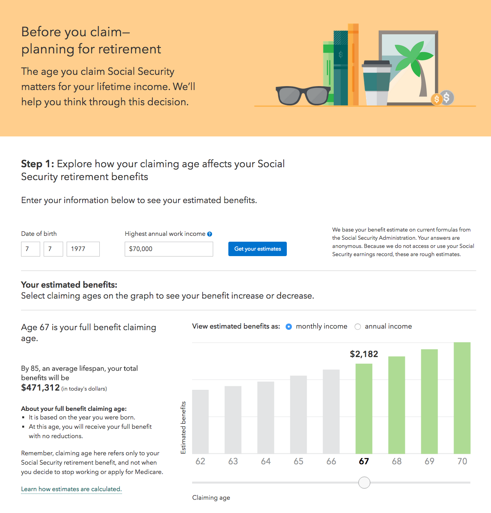
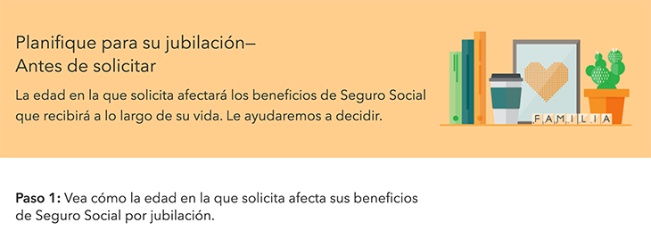

# :warning: THIS REPO IS DEPRECATED (June 3, 2021) :warning:

Please find the source code moved to https://github.com/cfpb/consumerfinance.gov/tree/main/cfgov/retirement_api

---

[](https://coveralls.io/r/cfpb/retirement)

# Retirement: Before You Claim

This is a project aimed at helping Americans make choices about retirement, including when to claim Social Security benefits.
  - **Status**: Beta




## [Edición español](http://www.consumerfinance.gov/retirement/before-you-claim/es/)



Tú puedes ver este app en español por poner `/es` al parte final del url.  
(You can view this app in Spanish by adding `/es` to the end of the url.)


### Setup dependencies
 * [pip](https://pypi.python.org/pypi/pip)
 * [virtualenv](https://virtualenv.pypa.io/en/latest/)
 * [virtualenvwrapper](https://virtualenvwrapper.readthedocs.org/en/latest/)
 * [Node](http://nodejs.org/)
 * [Gulp](http://gulpjs.com/)
 * [Bower](https://bower.io/)

### Code dependencies
 * [Django 2.2](https://docs.djangoproject.com/en/2.2/)
 * [BeautifulSoup4](http://www.crummy.com/software/BeautifulSoup/bs4/doc/)
 * [Python-dateutil](https://dateutil.readthedocs.org/en/latest/)
 * [Requests](http://docs.python-requests.org/en/latest/)

### For Python testing
 * [mock](https://mock.readthedocs.org/en/latest/)
 * [coverage](http://nedbatchelder.com/code/coverage/)

### For browser testing
* [selenium](http://selenium.googlecode.com/svn/trunk/docs/api/py/index.html)
* [behave](http://pythonhosted.org/behave/)
* [pyhamcrest](https://pyhamcrest.readthedocs.org/)

### Installation
The tool is a Django module, intended to be installed in a larger Django project. But it can run on its own in a Mac or Linux environment, assuming you have the setup dependencies of pip, virtualenv and virtualenvwrapper installed. Here's how:

Go to where you want the project to be created, make a virtual environment, clone this repository (or your own fork of it) and install requirements and settings.
```bash
mkvirtualenv retirement
git clone https://github.com/cfpb/retirement.git
cd retirement
setvirtualenvproject
pip install -e '.[testing]'
```

Build the front-end requirements and the JavaScript files.
```bash
./frontendbuild.sh
```

Create a standalone database and load the app's tables and content.
```bash
python manage.py migrate
python manage.py loaddata retirement_api/fixtures/retiredata.json
```

Fire up a development server.
```bash
python manage.py runserver
```

The "Before You Claim" page should load at [localhost:8000/before-you-claim/](http://localhost:8000/before-you-claim).

### Fonts
This application uses a proprietary licensed font (Avenir Next) that is not included in this repository.

By default it will try to load this font from the Fonts.com content delivery network (CDN).
This behavior can be modified to instead try to load the font locally from
the `retirement_api/static/retirement/webfonts/` directory by setting
[`@use-font-cdn`](https://github.com/cfpb/retirement/blob/main/src/css/main.less#L29)
to `false` and rebuilding the assets with `gulp build`. Restart the local web server
once you've made this change.

For Bureau employees or others with access to our private fonts repository,
you can perform this step by creating a symbolic link to your local copy of
the font files:

```sh
ln -s /path/to/cfgov-fonts/fonts/ retirement_api/static/retirement/webfonts
```

### Usage notes
- The app sends http requests to the Social Security Administration's [Quick Calculator](http://www.ssa.gov/OACT/quickcalc/index.html) to get benefit estimates for the chart.

### How to run software tests
- To run the Python tests, install [tox](https://tox.readthedocs.io/en/latest/) and then run it:

```bash
tox
```

- You can run the JavaScript tests with:

```bash
npm test
```

## Additional documentation
* [Front-end documentation](front-end.md)

## Getting involved
If you find a bug or see a way to improve the project, we'd love to hear from you.
Add an issue, or fork the project and send us a pull request with your suggested changes.

----

## Open source licensing info
1. [TERMS](TERMS.md)
2. [LICENSE](LICENSE)
3. [CFPB Source Code Policy](https://github.com/cfpb/source-code-policy/)


----
